<p align="center">
  <a href="README.md"><strong>English</strong></a> |
  <a href="README.zh-CN.md"><strong>简体中文</strong></a>
</p>

<h1 align="center">CrossFit WHOOP Video</h1>

<p align="center">
  面向 CrossFit 和训练素材的竖屏 4K 运动广告工作流，支持 WHOOP 风格动态数据 HUD、Codex Skill 和 OpenClaw 参考用法。
</p>

<p align="center">
  <a href="docs/CODEX_USAGE.zh-CN.md">Codex / OpenClaw 用法</a> |
  <a href="docs/WORKFLOW.zh-CN.md">工作链路</a> |
  <a href="docs/ENVIRONMENT.zh-CN.md">基础环境</a> |
  <a href="docs/TUTORIAL.zh-CN.md">教程</a> |
  <a href="README.md">English</a>
</p>

<p align="center">
  <a href="plugins/crossfit-whoop-video/.codex-plugin/plugin.json"></a>
  <a href="docs/ENVIRONMENT.zh-CN.md"></a>
  <a href="docs/CODEX_USAGE.zh-CN.md"></a>
  <a href="docs/WORKFLOW.zh-CN.md"></a>
  <a href="LICENSE"></a>
</p>

> **中文用户从这里开始。** 本仓库所有面向用户的英文说明都提供对应 `*.zh-CN.md` 中文版；后续文档更新应保持中英文同步。

这是一个可复用的竖屏运动短片项目，目标是把 CrossFit 或其他训练素材剪成 9:16、4K、运动广告风格的视频，并叠加 WHOOP 风格的数据 HUD。项目同时提供普通 HyperFrames 模板、Codex Skill 和 Codex Plugin 三种使用方式。

## 从这里开始

| 你想做什么 | 阅读这里 |
| --- | --- |
| 我用 Codex，想安装并直接使用这个 skill/plugin | [Codex 普通用户流程](docs/CODEX_USAGE.zh-CN.md#codex-普通用户流程) |
| 我用 OpenClaw，想安装并直接使用这个 skill/plugin | [OpenClaw 普通用户流程](docs/CODEX_USAGE.zh-CN.md#openclaw-普通用户流程) |
| 我是开发者，想本地运行或改模板 | [高级用法：本地模板方式](docs/CODEX_USAGE.zh-CN.md#高级用法本地模板方式) |
| 为 OpenClaw、本地渲染或二次开发安装基础工具 | [基础环境要求](docs/ENVIRONMENT.zh-CN.md) |
| 理解完整剪辑和生成链路 | [项目完整工作链路](docs/WORKFLOW.zh-CN.md) |

## 效果预览

下面是合成动态预览图，用来展示竖屏运动广告和多种 WHOOP 风格 HUD 的方向。它们不使用你的真实训练画面、真实 WHOOP 数据、token 或本地路径。





## 项目里有什么

- `crossfit-whoop-ad/`：通用 HyperFrames 视频模板，适合直接换素材、换数据、重新渲染。
- `crossfit-20260520-ad/`：一次完整 CrossFit 短片项目的可复用源码、WHOOP HUD 模板和剪辑方法论。
- `skills/crossfit-whoop-video/`：Codex Skill，让 Codex 以后按这套方法帮你剪运动视频。
- `plugins/crossfit-whoop-video/`：Codex Plugin bundle，把 skill 打包成插件形式。
- `docs/TUTORIAL.md`：英文教程。
- `docs/OPENCLAW_COMPATIBILITY.md`：OpenClaw 兼容说明。

仓库不会包含你的私人视频、渲染成片、`.env`、WHOOP token 或真实 WHOOP 数据。

## 最快方式：在 Codex 中使用

对大多数 Codex 用户来说，目标很简单：让 Codex 帮你安装这个 skill/plugin，启用 HyperFrames 或等价的视频生成能力，上传训练视频或粘贴本地路径，然后让 Codex 按这套方法剪辑。

```text
使用 crossfit-whoop-video 的工作流，把我上传的 CrossFit 素材剪成 50 秒竖屏 4K 运动广告。风格要电影感、高燃。WHOOP 风格数据只在开头、高强度段落和结尾总结出现。
```

如果当前 Codex 插件/环境已经提供视频渲染能力，Codex 用户通常不需要在开始前手动安装 `ffmpeg`、Node.js 或 Chrome。

## OpenClaw 使用方式

OpenClaw 用户的目标也是“安装后直接用”。建议安装普通 skill 或兼容 plugin bundle，然后让 OpenClaw 使用 `crossfit-whoop-video` 处理本地素材路径。真实渲染仍需要 OpenClaw 所在机器具备本地视频工具链。

```bash
openclaw skills install ./skills/crossfit-whoop-video --as crossfit-whoop-video
```

详细说明见 [Codex / OpenClaw 使用指南](docs/CODEX_USAGE.zh-CN.md) 和 [OpenClaw 兼容说明](docs/OPENCLAW_COMPATIBILITY.zh-CN.md)。

## 本地模板方式

如果你想自己 clone 仓库、编辑 `template.config.json`、配置 WHOOP 数据并运行 HyperFrames/ffmpeg 流水线，可以使用本地模板。

```bash
cd crossfit-whoop-ad
npm run dry-run
```

详细说明见 [基础环境要求](docs/ENVIRONMENT.zh-CN.md) 和 [完整模板教程](docs/TUTORIAL.zh-CN.md)。

## WHOOP HUD 样式

项目内置了 10 个 WHOOP 风格 HUD 预设，机器可读目录位于 `skills/crossfit-whoop-video/assets/whoop-hud-templates.json`，plugin bundle 里也有同步版本。里面包含你之前沉淀的 `01`、`02`、`04` 等可复用样式，也新增了全息矩阵、速度 BPM 爆发、恢复环、冲击标题等更科技感的样式。

用户也可以直接通过 prompt 自定义 HUD。Codex/OpenClaw 应该先选择最接近的预设模板，再根据提示词调整氛围、位置、数据密度、动效强度、颜色、指标和出现窗口。

## 中文文档索引

- [基础环境要求](docs/ENVIRONMENT.zh-CN.md)
- [项目完整工作链路](docs/WORKFLOW.zh-CN.md)
- [使用教程](docs/TUTORIAL.zh-CN.md)
- [完整使用指南：本地、Codex、OpenClaw、上传视频和提示词](docs/CODEX_USAGE.zh-CN.md)
- [OpenClaw 兼容说明](docs/OPENCLAW_COMPATIBILITY.zh-CN.md)
- [通用模板说明](crossfit-whoop-ad/README-TEMPLATE.zh-CN.md)
- [通用模板视觉设计](crossfit-whoop-ad/DESIGN.zh-CN.md)
- [2026-05-20 项目说明](crossfit-20260520-ad/README.zh-CN.md)
- [2026-05-20 视觉设计](crossfit-20260520-ad/DESIGN.zh-CN.md)
- [剪辑方法论](crossfit-20260520-ad/docs/VIDEO_EDITING_METHODOLOGY.zh-CN.md)
- [WHOOP HUD 模板指南](crossfit-20260520-ad/docs/WHOOP_HUD_TEMPLATES.zh-CN.md)
- [Flow 60s 视觉设计](flow-whoop-60s/DESIGN.zh-CN.md)
- [Plugin 中文说明](plugins/crossfit-whoop-video/README.zh-CN.md)
- [Skill 设备数据源说明](skills/crossfit-whoop-video/references/device-data-sources.zh-CN.md)
- [Skill 剪辑方法论](skills/crossfit-whoop-video/references/editing-methodology.zh-CN.md)
- [Skill WHOOP HUD 模板说明](skills/crossfit-whoop-video/references/whoop-hud-templates.zh-CN.md)

## 文档结构

本仓库按 GitHub 开源项目常见方式组织文档：根目录 README 负责快速理解和快速开始，`docs/` 放通用教程，具体项目目录放自己的 README/DESIGN，所有面向用户的英文说明都有对应 `*.zh-CN.md` 中文版。

```text
.
├── README.md                         # 英文项目概览和快速开始
├── README.zh-CN.md                   # 中文项目概览、快速开始和文档索引
├── LICENSE                           # 开源许可证
├── docs/assets/                      # 安全的合成预览素材
├── docs/
│   ├── ENVIRONMENT.md                # 基础环境和工具要求
│   ├── ENVIRONMENT.zh-CN.md
│   ├── WORKFLOW.md                   # 项目完整工作链路
│   ├── WORKFLOW.zh-CN.md
│   ├── CODEX_USAGE.md                # 本地/Codex/OpenClaw 使用和提示词范例
│   ├── CODEX_USAGE.zh-CN.md
│   ├── TUTORIAL.md                   # 完整模板使用教程
│   ├── TUTORIAL.zh-CN.md
│   ├── OPENCLAW_COMPATIBILITY.md     # OpenClaw 兼容说明
│   └── OPENCLAW_COMPATIBILITY.zh-CN.md
├── crossfit-whoop-ad/
│   ├── README-TEMPLATE.md            # 通用模板工作流
│   ├── README-TEMPLATE.zh-CN.md
│   ├── DESIGN.md                     # 通用模板视觉设计
│   └── DESIGN.zh-CN.md
├── crossfit-20260520-ad/
│   ├── README.md                     # 示例项目流水线说明
│   ├── README.zh-CN.md
│   ├── DESIGN.md                     # 示例项目视觉设计
│   ├── DESIGN.zh-CN.md
│   └── docs/
│       ├── VIDEO_EDITING_METHODOLOGY.md
│       ├── VIDEO_EDITING_METHODOLOGY.zh-CN.md
│       ├── WHOOP_HUD_TEMPLATES.md
│       └── WHOOP_HUD_TEMPLATES.zh-CN.md
├── skills/crossfit-whoop-video/
│   ├── SKILL.md                      # 给 agent 读取的 skill 入口
│   └── references/                   # skill 的人类可读参考文档
├── plugins/crossfit-whoop-video/
│   ├── README.md                     # 插件安装和使用说明
│   ├── README.zh-CN.md
│   └── skills/crossfit-whoop-video/  # 插件内置的 skill
└── flow-whoop-60s/
    ├── DESIGN.md                     # 早期 Flow 视频视觉设计
    └── DESIGN.zh-CN.md
```

`SKILL.md`、`AGENTS.md`、`CLAUDE.md` 属于 agent 运行指令文件，不作为普通用户说明文档逐字翻译，避免影响 Codex/OpenClaw 等工具读取 workflow。

## 开发者方式：作为普通视频模板

适合你或其他用户克隆仓库后自己放素材、填配置、渲染视频。

```bash
git clone https://github.com/whnnick/crossfit-whoop-video.git
cd crossfit-whoop-video/crossfit-whoop-ad
cp .env.example .env
npm run dry-run
```

`dry-run` 使用仓库里提交的合成静音音频占位文件。正式渲染前，请在 `template.config.json` 里把 `media.audio.src` 换成你自己的素材音频或音乐。

`crossfit-whoop-ad/assets/` 里提交的媒体文件都是为了开源验证准备的合成占位素材，不是真实训练视频，也不是真实 WHOOP 导出数据。

在 `.env` 里填自己的 WHOOP Developer 信息：

```text
WHOOP_CLIENT_ID=your_client_id
WHOOP_CLIENT_SECRET=your_client_secret
WHOOP_REDIRECT_URI=http://localhost:8977/callback
```

在 WHOOP Developer Dashboard 里把 redirect URL 设置成：

```text
http://localhost:8977/callback
```

授权并拉取 WHOOP 数据：

```bash
npm run whoop:auth
npm run whoop:fetch
```

然后编辑：

```text
crossfit-whoop-ad/template.config.json
```

把视频路径换成自己的素材。示例：

```json
{
  "media": {
    "videoA": {
      "src": "assets/training-a.mov",
      "source": "/absolute/path/to/your/video.mov",
      "mediaStart": 12
    }
  }
}
```

应用模板、检查并渲染：

```bash
npm run template:apply
npm run check
npm run template:render
```

默认输出在 `crossfit-whoop-ad/renders/`，渲染结果默认不会提交到 Git。

更完整的“Codex 怎么用、OpenClaw 怎么部署、本地模板怎么跑、视频怎么提供、提示词怎么写”见：

```text
docs/CODEX_USAGE.zh-CN.md
```

## OpenClaw 兼容性

OpenClaw 更适合把这个项目作为本地 agent 能力使用。普通 skill 方式最稳；plugin bundle 是否可用取决于当前 OpenClaw 版本对 Codex bundle 的支持。真实视频输出仍需要 OpenClaw 所在机器具备本地视频工具链。

详细说明见：

```text
docs/OPENCLAW_COMPATIBILITY.md
```

## WHOOP 和其他设备数据

支持思路如下：

- WHOOP：通过 OAuth/API 拉取 workout、recovery、sleep、cycle 等处理后的数据。
- Apple Watch：通过 Apple Health 导出 XML，或通过 HealthFit 等 App 导出 FIT/TCX/CSV。
- Garmin、Strava 等：可以接入 FIT、TCX、GPX、CSV，或用户自己实现授权 API。
- 手动数据：可以使用，但需要明确标注为 manual input，避免伪装成真实 API 数据。

注意：WHOOP API 提供的是处理后的训练、恢复、睡眠和周期数据，不是完整连续的实时心率原始流。视频里的动态数字通常是基于真实摘要数据做动画表达。

## 开源安全规则

不要提交这些文件：

- 原始训练视频，例如 `.mov`、`.mp4`
- 渲染结果，例如 `renders/*.mp4`
- `.env`
- `.whoop-token.json`
- `assets/whoop-data.json`
- `assets/whoop-data.js`
- 任何包含真实 token、Client Secret、个人路径或健康数据的文件

推送前可以检查：

```bash
git status --short --ignored
git ls-files
```

本仓库的 `.gitignore` 已经默认排除了常见视频、音频、渲染产物和私密数据。

## 之后怎么用来剪新视频

最简单的协作方式是：

1. 把新视频素材放在本机某个文件夹。
2. 告诉 Codex 素材路径、目标时长、风格、必须保留的镜头。
3. 让 Codex 使用 `crossfit-whoop-video` 工作流；如果已安装 skill，也可以使用 `$crossfit-whoop-video`。
4. Codex 根据素材分析、分镜、转场、WHOOP HUD、音乐和输出规格生成项目或成片。

示例：

```text
使用 $crossfit-whoop-video，把 /path/to/video1.mov 和 /path/to/video2.mov 剪成 60 秒竖屏 4K CrossFit 运动广告。节奏要电影感，WHOOP 数据只在开头、中段高强度和结尾总结出现。
```

如果只想使用模板，不想用 Codex，也可以直接改 `template.config.json` 后运行 npm 脚本。

`crossfit-20260520-ad/` 和 `flow-whoop-60s/` 是之前剪辑的源码示例。它们的完整 `npm run check`/渲染命令需要已生成的媒体资产，这些资产不会提交到开源仓库；干净 checkout 验证时请使用各自的 `npm run check:source`。

## 许可证和声明

本项目使用 `LICENSE` 中的开源许可证。

WHOOP 是 WHOOP, Inc. 的商标。本项目不是 WHOOP 官方项目，也没有得到 WHOOP 官方背书。HUD 风格用于运动数据可视化模板，不应冒充官方 WHOOP 应用界面。
